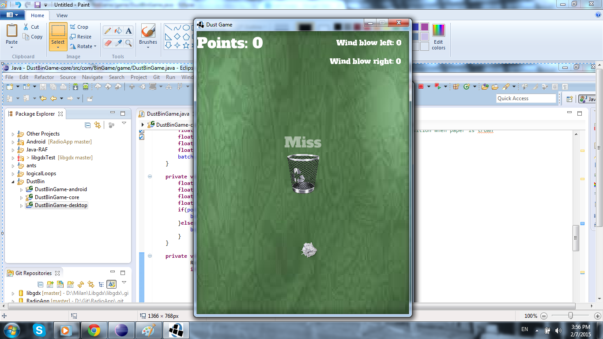

"Paper toss is finger flick game, with objective of trowing crushed paper into trash bin. This repository contains source code for game, to play it you need to create download and create libgdx project. Then only thing you need to do is to copy source code to core of your project tree." 

