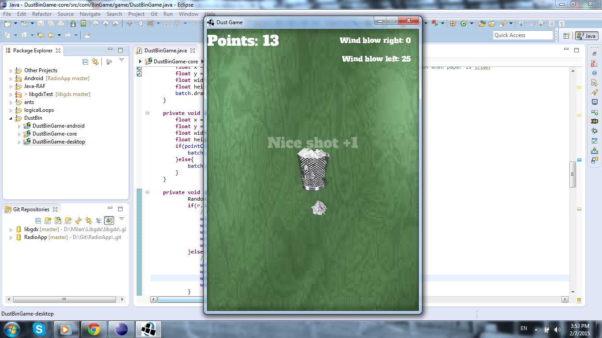

"Paper toss is game of tosing paper into the bin, with some physics. This repository contains source code for game, to play it you need to create download and create libgdx project. Then only thing you need to do is to copy source code to core of your project tree." 

